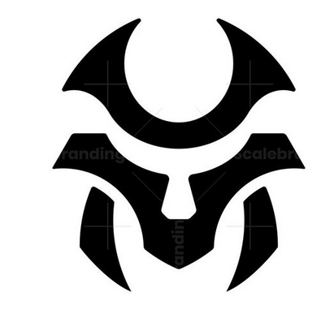

<!-- PROJECT LOGO -->
<br />
<div align="center">
  <a href="https://github.com/othneildrew/Best-README-Template">
    
  </a>

  <h3 align="center">Hermit</h3>

  <p align="center">
    A <b>Secure MutltiParty Computation Collaboration</b> Platform build on top of Filecoin to enhance AI privacy.
    <br />
    <a href="https://github.com/othneildrew/Best-README-Template">View Demo</a>
    ·
    <a href="https://github.com/othneildrew/Best-README-Template/issues/new?labels=bug&template=bug-report---.md">Report Bug</a>
    ·
    <a href="https://github.com/othneildrew/Best-README-Template/issues/new?labels=enhancement&template=feature-request---.md">Request Feature</a>
  </p>
</div>


<!-- TABLE OF CONTENTS -->
<details>
  <summary>Table of Contents</summary>
  <ol>
    <li>
      <a href="#about-the-project">About The Project</a>
      <ul>
        <li><a href="#built-with">Built With</a></li>
      </ul>
    </li>
    <li>
      <a href="#getting-started">Getting Started</a>
      <ul>
        <li><a href="#prerequisites">Prerequisites</a></li>
        <li><a href="#installation">Installation</a></li>
      </ul>
    </li>
    <li><a href="#usage">Usage</a></li>
    <li><a href="#roadmap">Roadmap</a></li>
    <li><a href="#contributing">Contributing</a></li>
    <li><a href="#license">License</a></li>
    <li><a href="#contact">Contact</a></li>
    <li><a href="#acknowledgments">Acknowledgments</a></li>
  </ol>
</details>


<!-- ABOUT THE PROJECT -->
## About The Project

![Product Name Screen Shot][product-screenshot]

The need for collaborative data analysis in today's networked world is evident in a variety of industries, including healthcare and finance. However, the overriding concern for data security and privacy frequently stymies this requirement for cooperation. This is where Secure Multi-Party Computation (SMPC) shines as a solution that allows for collaboration while protecting private data using cryptographic methods. However, the scalability, efficiency, and ease of integration of current Coll frameworks are frequently lacking. 
Presenting **THE HERMIT**—a novel SMPC solution painstakingly designed to confront these issues head-on. **THE HERMIT** promises to transform collaborative data analysis in the digital era by providing strong privacy guarantees, unmatched scalability, and smooth integration capabilities. Privacy and security are always guaranteed.


<!-- GETTING STARTED -->
## Getting Started

### Prerequisites

This is an example of how to list things you need to use the software and how to install them.
* npm
  ```bash
  $ npm install npm@latest -g
  ```
* cargo
    ```bash
    $ curl https://sh.rustup.rs -sSf | sh
    ```
* docker
    Depending on the distro
    ```bash
    $ sudo dnf install docker
    ```
### Beginning THE HERMIT's Journey:

Greetings from THE HERMIT, the ultimate in collaborative data analysis that protects privacy! Start your technological adventure with THE HERMIT by carefully setting up and implementing the following components:

#### **Base setup**:
Fork this repo and clone it into your local
```bash
$ git clone https://github.com:<your_username>/Hermit && cd Hermit
```

#### **Zero-Knowledge (zk) Server**:
Launch the zk server instance, which is the foundation for THE HERMIT's cryptographic activities. Verify the zk server's correct operation to guarantee the smooth execution of cryptographic protocols, which is necessary for the creation and validation of cryptographic proofs.
```bash
$ cd zk
$ cargo run
```
#### **SMPC Server**: 
Start up THE HERMIT ecosystem's dependable platform for secure multi-party computation (SMPC), the SMPC server infrastructure. Maximize performance and resilience in server settings to provide effective computation over dispersed datasets and protect data privacy using cryptographic primitives.


#### **Collaborator Server**: 
Turn on the infrastructure of Collaborator Server, which is essential for promoting coordination and communication between various parties.


### Architecture & Data
The data flow in our application contains mainly of three phases :
#### **Belman's zk-SNARKs and zkProofs:**:
When two parties decide to collaborate the first ensures integrity in both the datasets provided

Bellman's zk-SNARKs, which offer brief, non-interactive arguments of knowledge, are used to construct zkProofs.
Without disclosing the actual data, partners can use these proofs to confirm that the number of data points in respective datasets is identical.
Bellman's zk-SNARKs provide effective verification and small proof sizes by utilizing sophisticated cryptographic techniques including polynomial commitment schemes and elliptic curve pairings.
A trusted setup step is used to build proving and verifying keys, and then a zk-circuit representing the equality constraint between the dataset sizes is created as part of the proof generation process.
Data privacy and integrity are guaranteed since zkProofs can be effectively validated by anybody without requiring access to the underlying datasets once they have been created.

#### **Uploading  Data to Filecoin and IPFS:**:

Collaborators use the decentralized peer-to-peer file sharing technology IPFS to upload their datasets.
To ensure tamper-resistance and information integrity, IPFS uses cryptographic hashing to create content-based addresses, also known as information IDs or CIDs, for uploaded data.
In addition, partners start a storage agreement on the decentralized Filecoin storage network.
Filecoin uses cryptographic proofs, including Proof-of-Spacetime (PoSt) and Proof-of-Replication (PoRep), to confirm that storage providers are adhering to the storage agreements.
These cryptographic techniques preserve the secrecy of partners' datasets while ensuring data availability, redundancy, and durability in a trustless and decentralized way.

#### **SMPC**
SMPC facilitates collaborative decision tree training via secret sharing and secure function evaluation (SFE). Shamir's Secret Sharing Scheme fragments training data into shares for collaborators. Reconstruction requires a pre-defined threshold, ensuring individual data privacy.

SFE protocols like Yao's garbled circuits or oblivious transfer (OT) handle decision tree node computations. Yao's garbled circuits transform the tree into a circuit with wires representing data and gates representing computations. Collaborators receive obfuscated circuit sections and secret keys corresponding to their data. Secure comparisons are performed without revealing actual data values. OT enables one party to transmit messages to another such that the receiver learns only the chosen message, oblivious to others' content. This facilitates secure data point comparisons against chosen thresholds.

Collaborators iteratively evaluate nodes using SFE. Secret shares of decision outcomes propagate down the tree based on a pre-defined aggregation function (e.g., majority vote) while maintaining individual data point secrecy. This culminates at the terminal nodes, revealing the final decision tree for collaborative tasks.

The choice of SFE protocol and secret sharing scheme impacts efficiency. Techniques like homomorphic encryption or packed SFE can improve efficiency for specific cases, but often introduce trade-offs in security or communication complexity. Research focuses on optimizing protocols for practicality while maintaining strong privacy guarantees.


<!-- ROADMAP -->
## Roadmap

- [x] Add Changelog
- [ ] Implment the Compiler in Rust
- [ ] Add Additional Templates w/ Examples
- [ ] Add "components" document to easily copy & paste sections of the readme

See the [open issues](https://github.com/othneildrew/Best-README-Template/issues) for a full list of proposed features (and known issues).

<p align="right">(<a href="#readme-top">back to top</a>)</p>

## Usage 

Imagine you're building a model to classify handwritten digits (0-9). Each row represents a flattened image of a digit, with the four features capturing characteristics like pixel intensities in different regions. The fifth element would then indicate the actual digit (0, 1, 2, etc.).

we are taking this dataset as our input dataset for the smpc training and outputting the Decision tree made along with their node id's and other relevant data.

<!-- CONTRIBUTING -->
## Contributing

Contributions are what make the open source community such an amazing place to learn, inspire, and create. Any contributions you make are **greatly appreciated**.

If you have a suggestion that would make this better, please fork the repo and create a pull request. You can also simply open an issue with the tag "enhancement".
Don't forget to give the project a star! Thanks again!

1. Fork the Project
2. Create your Feature Branch (`git checkout -b feature/AmazingFeature`)
3. Commit your Changes (`git commit -m 'Add some AmazingFeature'`)
4. Push to the Branch (`git push origin feature/AmazingFeature`)
5. Open a Pull Request

<p align="right">(<a href="#readme-top">back to top</a>)</p>


<!-- LICENSE -->
## License

Distributed under the MIT License. See `LICENSE.txt` for more information.

<p align="right">(<a href="#readme-top">back to top</a>)</p>


<!-- ACKNOWLEDGMENTS -->
## Research Papers
These are the list of Research we used to gain knowledge about smpc
* [Efficient decision tree training with new data structure for secure multi-party computation](https://arxiv.org/pdf/2112.12906.pdf)
* [Squirrel: A Scalable Secure Two-Party Computation Framework for Training Gradient Boosting Decision Tree](https://eprint.iacr.org/2023/527.pdf)

<p align="right">(<a href="#readme-top">back to top</a>)</p>


<!-- MARKDOWN LINKS & IMAGES -->
<!-- https://www.markdownguide.org/basic-syntax/#reference-style-links -->
[contributors-shield]: https://img.shields.io/github/contributors/othneildrew/Best-README-Template.svg?style=for-the-badge
[contributors-url]: https://github.com/othneildrew/utkarshdagoat/Hermit/contributors
[forks-shield]: https://img.shields.io/github/forks/othneildrew/Best-README-Template.svg?style=for-the-badge
[forks-url]: https://github.com/utkarshdagoat/Hermit/members
[stars-shield]: https://img.shields.io/github/stars/othneildrew/Best-README-Template.svg?style=for-the-badge
[stars-url]: https://github.com/utkarshdagoat/Hermit/stargazers
[issues-shield]: https://img.shields.io/github/issues/othneildrew/Best-README-Template.svg?style=for-the-badge
[issues-url]: https://github.com/utkarshdagoat/Hermit/issues
[product-screenshot]: images/frontend.jpeg
[Next.js]: https://img.shields.io/badge/next.js-000000?style=for-the-badge&logo=nextdotjs&logoColor=white
[Next-url]: https://nextjs.org/
